# Target Architecture

## Purpose and boundary

The target is a small, auditable daily research-to-order system around the existing Research Graph. It is not a rewrite of `tradingagents/`. The upstream-derived graph remains useful for evidence interpretation; the existing `mytradingalpha/` package owns Foundation, PIT, and closed cached-response replay. Production-owned numerical decisions, portfolio accounting, risk controls, execution simulation, and broker integration remain later roadmap work.

The MVP supports long-only, unlevered liquid US equities/ETFs from a small allowlist. A run makes a close decision and may execute no earlier than the next eligible session. FND-01 through FND-04, PIT-01 through PIT-06, and SIG-01 are implemented at their contract scope; SIG-02 and subsequent behavior in this target diagram remain planned. Use the [current implementation index](README.md#current-implementation-and-evidence-index) and actual GitHub state rather than interpreting the diagram as shipped functionality.

## System overview

```mermaid
flowchart LR
    V[Versioned vendor captures] --> D[PIT Data / Calendar]
    D --> E[Immutable EvidenceBundle]
    E --> Q[Deterministic QuantSignal]
    E --> R[Research adapter]
    C[Separately sealed cached response] --> R
    R --> L[Bounded LLMOverlay]
    Q --> S[SignalEnvelope]
    L --> S
    S --> A[Rule allocator]
    A --> T[TargetPortfolio]
    T --> K[Deterministic RiskEngine]
    K --> I[OrderIntent]
    I --> X[Execution simulator]
    I --> O[OMS / BrokerAdapter]
    X --> G[Append-only Ledger]
    O --> G
    G --> M[Metrics / GateEvidence]
    M --> P[Paper and promotion gates]
```



The simulator and OMS share `OrderIntent`, `OrderEvent`, and `Fill` contracts. A broker adapter is unavailable in historical mode and is feature-flagged off by default everywhere else. Phase 07 may write to an isolated paper endpoint after approval; live-broker writes remain false until explicit Phase 09 authorization.

## Bounded contexts and dependency rule

```text
mytradingalpha.contracts  <- shared schemas, enums, reason codes
mytradingalpha.data       <- vendor capture, PIT store, calendars, EvidenceBundle
mytradingalpha.research   <- adapter around tradingagents; no portfolio authority
mytradingalpha.quant      <- deterministic features and QuantSignal
mytradingalpha.portfolio  <- allocator and TargetPortfolio
mytradingalpha.risk       <- hard RiskEngine and persistent halts
mytradingalpha.backtest   <- clock, simulator, ledger, metrics
mytradingalpha.execution  <- OMS, broker adapter, reconciliation
mytradingalpha.experiments<- variants, seeds, reports, statistical tests
mytradingalpha.ops        <- config, scheduler, alerts, runbooks
```

The allowed direction is from production-owned contexts toward `contracts`; `data` feeds `research` and `quant`; `portfolio` consumes signals; `risk` guards portfolios and intents; `backtest` and `execution` consume shared contracts; `experiments` and `ops` orchestrate without changing domain decisions. Only `mytradingalpha.research` may import `tradingagents` through a narrow adapter. No file under `tradingagents/` may import `mytradingalpha`; other production contexts consume contracts and adapters rather than importing the Research Graph. This keeps the current graph's public behavior stable and prevents an LLM node from bypassing controls.

## Trust and permission boundaries

| Boundary | Input | Allowed action | Prohibited action |
| --- | --- | --- | --- |
| Vendor boundary | Untrusted API payloads, timestamps, revisions | Capture, validate, normalize, record provenance | Treat a vendor timestamp as proof of availability without policy checks |
| Evidence boundary | Immutable, hash-addressed `EvidenceBundle` | Read-only research and feature calculation | Network access, mutation, current-time lookup, hidden data joins |
| LLM boundary | Evidence excerpts and `ResearchNote` | Emit typed overlay reason/action/abstain | Increase quant influence, set weights, create orders, access credentials |
| Deterministic decision boundary | Quant signal, overlay, snapshot, policy | Allocate, validate constraints, fail closed | Accept prose as a numeric risk authorization |
| Credential boundary | Broker secret in a process-specific secret store | Submit only when the deployment mode and feature flag permit | Persist secrets in artifacts, logs, prompts, or fixtures |
| Ledger boundary | Validated events/fills | Append immutable accounting events and derived NAV | Rewrite history or charge a fee twice |

PIT (point-in-time) strictly separates what was knowable then from what became known later. Fail-closed means that unmet conditions allow only a halt or no trade.

## Deployment modes

### Historical

`RunContext.mode=historical` requires an immutable bundle hash and a component-scoped network policy with `data_capture_egress`, `model_provider_egress`, `research_tool_egress`, `paper_broker_egress`, and `live_broker_egress` all false. SIG-01 selects a separate canonical cached-response record by exact ID/hash and bundle/context/instrument/artifact bindings; it does not embed responses in EvidenceBundle v1. Both replay policies verify `available_at <= knowledge_cutoff`; archive-realistic replay additionally verifies `ingested_at <= knowledge_cutoff`. The generic validator receives plain JSON state, never LangChain message objects, runtime callables, or a live graph. Missing, corrupt, or ineligible responses yield typed failure/no trade without fallback. No ordinary graph construction, pending-memory outcome fetch, current yfinance refresh, Polymarket request, or live credentials are allowed. The [approved amendment](phases/02-evidence-agent-boundary/SIG_01_AMENDMENT_PROPOSAL.md) defines the unchanged UTC cutoff-date label.

### Forward paper

This is planned scope, not an implemented capture service or authorization to operate. The [archive-realistic v1 producer schedule](03_CONTRACTS_AND_SCHEMAS.md#closed-response-capture-and-replay-handoff) preregisters a pre-close input freeze and a fixed close-time deadline. It seals the exact bundle before requesting model-bearing responses, which must genuinely be available and ingested by that deadline. The current closing bar cannot be included in pre-close inputs. A late response remains unavailable; never move the cutoff after observing latency or backdate output. Model-free variants need no cached model response, and SIG-02 does not perform inference.

After the relevant software/evidence gates and separate provider/PAPER authorization, the scheduler may run the selected quant/research/allocator/risk path and send approved intents only to the deterministic paper adapter or an approved PAPER endpoint. Its component-scoped policy may allow `data_capture_egress`, an approved `model_provider_egress`, and `paper_broker_egress` while keeping `research_tool_egress=false` and `live_broker_egress=false`. Preparatory capture cannot dispatch orders. Operational promotion requires eight to twelve weeks of real elapsed session evidence, reconciliation, and human review; simulated calendars prove software behavior only, not long-term alpha.

### Live pilot

Promotion is staged: L0 read-only; L1 one/few symbols with human approval; L2 small allowlist with human-approved batches; later automation requires a new approval. Paper endpoint writes are introduced in Phase 07 after approval; live-broker write access remains feature-flagged false until Phase 09. No live-capable PR is merged before Phase 09.

## Failure policy

| Failure | Historical | Paper | Live pilot |
| --- | --- | --- | --- |
| Missing or stale required observation | Reject bundle/run | Skip symbol and alert; no intent | Persistent halt for affected scope; human review |
| Unavailable optional evidence | Record `degraded`; continue only if variant permits | Continue with explicit reason code | Continue only under approved policy; otherwise halt |
| Missing/ineligible cached response or overlay schema error | Typed failure/no trade; no new inference or ordinary-graph fallback. Quant-only runs separately under its own preregistration. | No new trade; existing holdings follow risk policy | No new trade; alert and halt if policy says fail closed |
| Risk limit breach | Mark run invalid | Reject intent and persist halt if hard limit | Reject, persist halt, page operator |
| Unknown broker acknowledgement | Not applicable | Pause/query; never blind resubmit | Pause/query; reconcile before any retry |
| Ledger or reconciliation mismatch | Fail the run | Freeze promotion and reconcile | Persistent halt, preserve evidence, operator approval required |

All failures carry a stable reason code, run ID, bundle hash, and correlation ID. Exceptions are not converted into a successful decision. Persistent halts are stored outside process memory and require an explicit, audited clear operation.

## Migration path

1. Add package/config scaffolding without changing `tradingagents/` behavior.
2. Capture PIT observations and build immutable bundles; SIG-01 replays separately sealed responses without constructing the ordinary graph.
3. Add deterministic quant and the bounded overlay boundary; compare outputs without orders.
4. Add clock, simulator, ledger, and baselines; prove accounting and cost invariants.
5. Add rule allocator and shared hard risk; run offline only.
6. Add cost/liquidity model, experiment runner, and sealed evaluation.
7. Add OMS, paper adapter, broker interface, and reconciliation behind a false-by-default flag.
8. Operate forward paper for 8–12 weeks and review gate evidence.
9. Start L0/L1 live pilot only after an explicit approval, with rollback to paper/read-only.

Each step is additive. A failed gate rolls traffic back to the previous mode, leaves append-only evidence intact, and does not require rewriting historical artifacts.

## Observability and security baseline

Every run emits `run_id`, `decision_time`, `knowledge_cutoff`, bundle hash, variant, model/provider IDs (without secrets), data-quality status, overlay decision, risk reason codes, intent IDs, fill IDs, ledger sequence, and reconciliation status. Metrics cover latency, missingness, stale data, model failures, risk rejects, turnover, costs, fills, and drift. Logs are structured and redact API keys, access tokens, private broker identifiers, and raw sensitive payloads. Artifacts are content-addressed and retention is policy-controlled.

## Acceptance criteria

- Historical mode is network-free and fails any cutoff violation.
- The LLM overlay cannot produce weights or orders, cannot increase quant influence, and always yields no trade on failure or abstain.
- Rule allocation and deterministic risk are usable without an optimizer or LLM.
- Simulator accounting, fees, and fills are deterministic and feed the same ledger contracts as paper/OMS.
- OMS handles every transition in [`03_CONTRACTS_AND_SCHEMAS.md`](03_CONTRACTS_AND_SCHEMAS.md), including unknown acknowledgement without blind resubmission.
- Promotion evidence distinguishes local tests, backtest evidence, operational paper evidence, and live approval.
